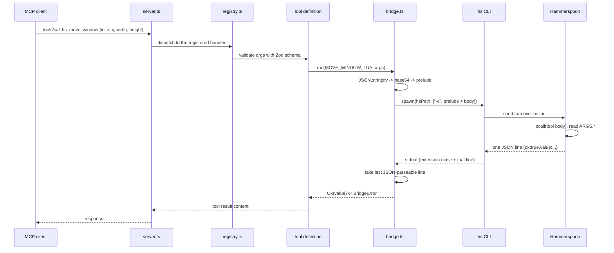

# Architecture

How the server is put together, and why. If you only read one section, read
[The ARGS codec](#the-args-codec), because that is the property everything else
is arranged to protect.

## The shape of the problem

Hammerspoon is a macOS automation app scripted in Lua. Its `hs.ipc` module
installs a command line tool, `hs`, which sends Lua to the running Hammerspoon
process and prints whatever comes back:

```sh
hs -c "return hs.screen.primaryScreen():name()"
```

So a bridge between an AI agent and Hammerspoon comes down to three jobs:

1. Turn a typed tool call into Lua.
2. Run it through `hs`.
3. Turn the output back into a structured result.

Job 1 is where the security of the whole thing is decided. Jobs 2 and 3 are
where the reliability is decided, because the `hs` CLI is chatty and
Hammerspoon can hang.

## Layers

```
MCP client (Claude Code, Claude Desktop, ...)
        |  JSON-RPC over stdio
        v
+-----------------------------------------------+
|  main.ts        bin entry, serveStdio,        |
|                 signal handling               |
+-----------------------------------------------+
|  server.ts      builds the McpServer,         |
|                 filters tools by tier         |
+-----------------------------------------------+
|  tools/registry.ts   defineTool, result       |
|                      helpers                  |
+-----------------------------------------------+
|  tools/safe/*, tools/unsafe/eval.ts           |
|                 Zod schema + static Lua body  |
+-----------------------------------------------+
|  bridge/        codec, path, spawn, errors    |
+-----------------------------------------------+
        |  spawn(hsPath, ["-c", lua],
        |        { stdio: ["ignore", "pipe", "pipe"] })
        v
   hs CLI  --->  Hammerspoon.app (Lua runtime)
```

Each layer only knows the one below it. Tools do not know how the subprocess is
started. The bridge does not know what MCP is. That separation is what makes the
bridge testable with no Hammerspoon in the room: a test injects its own `exec`
function through `BridgeOptions` and nothing else changes.

One tool sits outside this stack. `hs_api_search` reads Hammerspoon's bundled
`docs.json` through `src/docs/docs-index.ts` and never calls the bridge, so it
answers even when Hammerspoon is not running. See
[API documentation search](#api-documentation-search).

### The request path



## The ARGS codec

`src/bridge/codec.ts`.

### What the usual approach gets wrong

The obvious way to pass a window title into Lua is to interpolate it:

```ts
const lua = `hs.window.find("${args.title}")`; // do not do this
```

Now the correctness of the whole server rests on escaping. Someone has to
remember quotes, backslashes, newlines, and Lua's long-bracket syntax
(`[[ ... ]]`, `[==[ ... ]==]`), forever, in every tool anyone ever adds. The
agent's arguments frequently come from untrusted text it read somewhere. One
missed case is arbitrary code execution.

Escaping is a discipline. Disciplines fail at the edges.

### What this server does instead

Every tool's Lua body is a static string constant in the TypeScript source. It
is written once, reviewed once, and never assembled at runtime. Arguments travel
out of band:

```
args object  ->  JSON.stringify  ->  Buffer.from(json).toString("base64")
```

The base64 text is spliced into exactly one place, a fixed prelude line:

```lua
local ARGS = hs.json.decode(hs.base64.decode("PGJhc2U2ND4=")) or {}
```

The full program sent to `hs` is that prelude, plus a `pcall` wrapper, plus the
static body. The body reads `ARGS.id`, `ARGS.width`, and so on. The `or {}` means
a tool that takes no arguments still sees a table rather than `nil`.

### The invariant has no exceptions

No tool in this codebase builds Lua by string concatenation. Not one, and that
includes `hs_eval`.

`hs_eval` is the tool that runs code the caller supplied, so it looks like the
obvious place to give up and splice. It does not. The supplied code travels
through the same base64 `ARGS` channel as every other argument, and the static
body compiles it inside Lua:

```lua
local chunk, compileError = load(ARGS.code, "hs_eval", "t")
if not chunk then error("syntax error: " .. tostring(compileError), 0) end
return chunk()
```

That buys two things. The codec invariant stays absolute, so "does any tool
splice?" has a one-word answer instead of a list of exceptions to audit. And a
syntax error in the supplied code becomes a clean `LuaError` naming `hs_eval`,
instead of a mangled program whose parse failure lands somewhere unrelated.

The security boundary for `hs_eval` is the tier, not the encoding. Arbitrary Lua
can do anything the user can do. Encoding it safely just means the failure modes
are the ones you asked for.

### Why base64 makes injection impossible

Standard base64 output uses exactly these characters:

```
A-Z  a-z  0-9  +  /  =
```

Look at what is missing:

| Character   | What it would let an attacker do | In base64? |
| ----------- | -------------------------------- | ---------- |
| `"`         | Close the Lua string             | no         |
| `'`         | Close a single-quoted string     | no         |
| `\`         | Start an escape sequence         | no         |
| newline     | End the statement                | no         |
| `[` `]`     | Open or close a long bracket     | no         |
| `-`         | Start a `--` comment             | no         |
| `;` `(` `)` | Chain or call                    | no         |

There is no character in the payload that can terminate the string literal it
sits inside. So there is no payload that reaches the Lua parser as code. This
holds no matter what the agent was told to send, and it holds without anyone
writing an escaping function.

The property comes from the **alphabet**, not from care. That is the point.
Escaping can be done wrong. An alphabet that lacks the dangerous characters
cannot be done wrong.

Two supporting details:

- **Encoding cannot fail.** `JSON.stringify` on a validated Zod object followed
  by base64 has no error path that produces partial output. Either you get the
  full encoded string or you get an exception before anything is sent.
- **Decoding happens inside Lua.** `hs.json.decode` produces a Lua table. It
  does not evaluate anything. A payload of `"os.execute('rm -rf ~')"` becomes a
  Lua string containing that text, not a call.

### No shell layer

Invocation is `spawn(hsPath, ["-c", lua], ...)`. `spawn` takes an argv array and
hands it straight to the operating system. There is no `sh -c`, so there is no
second quoting context to get right. Using `exec` with a command string would
put the shell back in the path and undo the whole design, which is why
[CONVENTIONS.md](../CONVENTIONS.md) bans it outright.

### The regression guard

`test/unit/tools/lua-safety.test.ts` is a meta-test. It reads the source of
every `.ts` file under `src/` and fails the build on four things:

1. **No Lua constant exists at all.** If the pattern below stops matching
   anything, the test is silently passing on nothing, so it asserts that it
   found some.
2. **A `*_LUA` constant contains `${`.** That is a template-literal
   interpolation, which means a value is being spliced into Lua source.
3. **A `*_LUA` constant is declared indented.** Indentation means the constant
   sits inside a function, which means it is rebuilt on every call and could
   capture a local. Module-level declaration is what makes "static" checkable by
   grep. The check matches `\n[ \t]+const ..._LUA` specifically, because `\s+`
   would span newlines and flag a top-level constant that merely has a blank
   line above it.
4. **`bridge.run` is called with anything other than an identifier ending in
   `LUA`.** A template literal, a concatenation, or a function call in that
   position is a splicing risk even when every named constant is clean.

These are blunt textual checks and that is fine. Their job is to make the day
someone reintroduces splicing a red CI run rather than a CVE. They also explain
the naming rule: the `_LUA` suffix is not decoration, it is what the scanner
matches on.

## Binary discovery

`src/bridge/hs-path.ts`.

The `hs` binary lands in different places depending on how Hammerspoon was
installed and which Homebrew prefix the machine uses. The server takes the first
path that exists:

1. `$HS_MCP_HS_PATH`, if set. Short-circuits everything below.
2. `~/.local/bin/hs` (the usual target of `hs.ipc.cliInstall()`)
3. `/opt/homebrew/bin/hs` (Homebrew on Apple Silicon)
4. `/usr/local/bin/hs` (Homebrew on Intel, or a manual install)
5. `/Applications/Hammerspoon.app/Contents/Frameworks/hs/hs` (inside the bundle)
6. `~/Applications/Hammerspoon.app/Contents/Frameworks/hs/hs` (per-user install)

The check is existence only (`existsSync`), not an executable-bit test. A path
that exists but cannot be run fails later as a spawn error, which the classifier
turns into `HsNotFound`.

An explicit `HS_MCP_HS_PATH` is trusted without probing the filesystem at all.
If the user named a binary, a clear failure at execution time is better than
quietly running a different one.

There is deliberately no `PATH` lookup. An MCP server is spawned by a graphical
application, and graphical applications on macOS inherit a minimal environment
that usually does not include Homebrew's `bin`. A bare `hs` that resolves in
your terminal often does not resolve for the server, so relying on `PATH` would
work on the developer's machine and fail on the user's. The absolute locations
above cover every normal install, and `HS_MCP_HS_PATH` covers the rest.

When nothing matches, the lookup returns the full list of paths it searched, and
that list goes into the `HsNotFound` hint. "Not found" is not actionable. "Not
found, here is every place I looked" is.

Resolution runs once, in the `HammerspoonBridge` constructor. The server builds
one bridge, so in practice that is once per process.

## The result protocol

Every tool's Lua produces exactly one JSON line on stdout. `buildProgram` in
`src/bridge/codec.ts` wraps the static body to guarantee it:

```lua
local ARGS = hs.json.decode(hs.base64.decode("<base64>")) or {}
local __ok, __res = pcall(function()
  -- static tool body, reads ARGS.*
  return { count = 3 }
end)
if not __ok then
  return hs.json.encode({ ok = false, err = tostring(__res) })
end
local __encoded, __json = pcall(hs.json.encode, { ok = true, value = __res })
if __encoded then return __json end
return hs.json.encode({ ok = true, value = tostring(__res), unencodable = true })
```

The program `return`s the JSON string rather than printing it. The `hs` CLI
prints whatever the program returns, so this stays one line and one line only.

The locals are `__` prefixed so a tool body can declare `ok`, `res`, or `json`
without colliding with the wrapper.

So the wire format is one of three shapes:

```json
{ "ok": true, "value": { "count": 3 } }
{ "ok": false, "err": "attempt to index a nil value" }
{ "ok": true, "value": "hs.window: Safari", "unencodable": true }
```

The third one exists because some Hammerspoon values cannot be JSON-encoded at
all. A cyclic table, or a userdata handle, makes `hs.json.encode` throw. Losing
the whole call to that is worse than handing back `tostring(value)` and a flag
saying so, so the encode itself runs under a second `pcall`.

`pcall` is what keeps a Lua runtime error from becoming a process-level failure
with no diagnosis. A crashed tool still returns a structured `err` the agent can
read and act on.

### Why the parser takes the last JSON-parseable line

The `hs` CLI prints its own noise before your output. Loading extensions emits
lines like:

```
-- Loading extension: window
-- Loading extension: json
{"ok":true,"value":{"count":3}}
```

Naively parsing the first line, or the whole of stdout, fails. So the decoder
splits stdout into lines, walks them from the end, and returns the first one
that parses as JSON and has a boolean `ok` field. Anything before it is
discarded as noise.

This also handles a tool body that logs with `print` for debugging. Its output
scrolls past, and the real result is still the last line.

If no line parses, that is a `ProtocolError`, described below.

## Invocation and timeouts

`src/bridge/bridge.ts` orchestrates one call:

1. Resolve the `hs` path (cached).
2. Encode args, assemble prelude plus body.
3. `spawn(hsPath, ["-c", lua], { stdio: ["ignore", "pipe", "pipe"] })`.
4. Classify the outcome into a success value or a `BridgeError`.

Calls are asynchronous. Synchronous child process calls are banned, because the
server holds an open protocol connection on a single thread. A blocking
subprocess means the server stops answering the client while Hammerspoon works.

### Why stdin is set to ignore

This one line is load-bearing, and getting it wrong makes the entire server
look broken.

The `hs` command line tool waits for end-of-file on stdin before it exits.
Node's `execFile` gives a child an open stdin pipe by default and never closes
it, so `hs` sits there waiting for input that will never arrive. Every single
call then hangs until the timeout fires. The first version of this bridge used
`execFile` and every integration test failed with a ten second `Timeout`, while
the exact same command run by hand in a terminal returned instantly. The
difference is that a terminal gives the process a real stdin that reaches
end-of-file.

Measured on this machine: 16ms with stdin closed, versus a full timeout
without.

`spawn` is used rather than `execFile` because it sets stdin to `ignore` up
front, as a property of how the child is created, instead of closing the pipe
afterwards and hoping nothing raced.

Only an integration test could have caught this. Unit tests inject a fake
`ExecFn`, so they never create a real process and never see the behaviour. The
regression guard lives in `test/unit/bridge/default-exec.test.ts` under the
name "completes without hanging, which proves stdin is closed", spawning Node
itself so it still runs in continuous integration. If that test ever starts
timing out, stdin handling has regressed.

Timeouts are **per tool**, declared in the tool's spec, not one global number.
`hs_list_windows` should answer in well under a second. `hs_reload_config` runs
the user's whole `init.lua` and reasonably takes longer. A single timeout would
have to be set for the slowest tool, which makes every fast tool hang for that
long when Hammerspoon is wedged.

Hammerspoon is single-threaded. A config stuck in a loop, or a modal dialog on
screen, means calls do not return. The timeout is what turns that into a
diagnosable error instead of an agent that appears to freeze.

## Error taxonomy

`src/bridge/errors.ts`. Every bridge failure is one of a closed set of kinds.
A tool call returns a `BridgeResult`, which is a discriminated union on `ok`, so
consumers cannot read a value without handling the failure case first.

```ts
type BridgeErrorKind =
  'HsNotFound' | 'HsNotRunning' | 'LuaError' | 'Timeout' | 'PayloadTooLarge' | 'ProtocolError';

type BridgeError = {
  readonly kind: BridgeErrorKind;
  readonly message: string; // short technical description
  readonly hint: string; // what the user should do about it
  readonly detail?: string; // raw underlying output, logs only
};

type BridgeResult<TValue> =
  | { readonly ok: true; readonly value: TValue }
  | { readonly ok: false; readonly error: BridgeError };
```

Errors are built by a small constructor per kind (`hsNotFound`, `hsNotRunning`,
`luaError`, `timeout`, `payloadTooLarge`, `protocolError`) rather than by
literal objects at call sites. That keeps the wording of a given failure in one
place, so improving a hint improves it everywhere.

| Kind              | Detected by                                                                                                   | Hint returned to the agent                                                                                          |
| ----------------- | ------------------------------------------------------------------------------------------------------------- | ------------------------------------------------------------------------------------------------------------------- |
| `HsNotFound`      | No candidate path exists, or `execFile` fails with `ENOENT`.                                                  | Install Hammerspoon, add `require("hs.ipc")`, or set `HS_MCP_HS_PATH`. The hint lists every path that was searched. |
| `HsNotRunning`    | The binary exists but the CLI cannot reach the app: non-zero exit, no result line, connection-shaped failure. | Open Hammerspoon, confirm `require("hs.ipc")` is in `init.lua`, reload the config.                                  |
| `LuaError`        | A well-formed result line with `ok: false`. The Lua ran and threw.                                            | Check the arguments, or call `hs_console_tail` for the surrounding log output. The Lua message is carried through.  |
| `Timeout`         | `execFile` kills the child at the per-tool deadline.                                                          | Hammerspoon may be blocked by a long-running Lua call or a modal dialog. Check the console, prefer smaller calls.   |
| `PayloadTooLarge` | The encoded ARGS blob exceeds the configured byte limit, checked before spawning anything.                    | Pass less data. Oversized payloads risk hitting the operating system's argument size limit.                         |
| `ProtocolError`   | The process exited cleanly but no line parsed as our result shape.                                            | This is a bug in the server, report it with the stderr log. The raw output is attached as `detail`.                 |

`PayloadTooLarge` is a pre-flight check, not a reaction to a failure. Base64
inflates a payload by about a third, and `execFile` passes the program as a
single argv entry, so a large enough argument object would hit `ARG_MAX` and
fail as an opaque spawn error. Rejecting it early turns that into a clear
message.

Note the `detail` field. Raw subprocess output goes to logs, not into the value
returned to the model, because that output is exactly the kind of untrusted text
that carries injected instructions. The agent gets `message` and `hint`, which
the server wrote.

Two more rules about this table.

**Every error carries an actionable hint.** An agent that gets "command failed"
retries the same call and fails the same way. An agent that gets "Hammerspoon is
not running, launch it and retry" can tell the user something true. Error
messages are the main interface a failing tool has with its caller, so they get
written as carefully as the success path.

**Detection lives in one place.** Matching CLI output to `HsNotRunning` involves
inspecting exit codes and message text, which is inherently a bit fragile.
Keeping all of it inside `errors.ts` means it is one file to fix when a
Hammerspoon release changes the wording, instead of a pattern smeared across
every tool.

## The server starts even when Hammerspoon is missing

A tempting design is to check for Hammerspoon at startup and exit if it is not
there. This server deliberately does not.

An MCP server that exits during startup gives the client nothing to work with.
The user sees "server failed" or a tool list that never arrives, with no
explanation, and the logs are somewhere they will not look. That is the worst
possible failure mode for a piece of software whose entire job is to be spawned
invisibly by another program.

So startup does no probing. Tools register, the transport connects, the server
answers. The first call that needs Hammerspoon returns a structured
`HsNotFound` or `HsNotRunning` with a hint the agent can read out loud and act
on. `hs_health` exists precisely so an agent can ask "is this working?" and get
a real answer instead of silence.

The rule generalises: **a diagnosable error beats a dead process.**

## Tool registry and tiers

`src/tools/registry.ts`.

A tool is a `ToolSpec`: a name, a tier, a description, a Zod v4 input schema, a
static Lua body, a timeout, and a function that shapes the decoded value into
MCP result content.

```ts
type ToolTier = 'safe' | 'unsafe';

type ToolSpec<TArgs> = {
  readonly name: string; // hs_snake_case, the wire format
  readonly tier: ToolTier;
  readonly description: string;
  readonly schema: z.ZodType<TArgs>;
  readonly lua: string; // static constant, never interpolated
  readonly timeoutMs: number;
};
```

Registration is a filter, not a runtime check:

1. `config/env.ts` parses `HS_MCP_TOOLS` into an allowed tier set. `safe` is the
   default. `all` means both tiers. Anything else is a startup error, because a
   typo that silently downgrades your configuration is worse than a crash.
2. The registry filters the spec list by that set.
3. Only the survivors are registered with the SDK.

The distinction matters. An unregistered tool is not in `tools/list`, so the
model never sees it, never suggests it, and cannot be talked into asking for it.
A tool that is registered but refuses at call time still advertises a capability
and still invites attempts. Filtering at registration is the stronger position.

`safe` today means read, inspect, and arrange: listing windows and apps, moving
and focusing them, searching docs, reading the console, reloading config, and
posting a notification. `unsafe` today means `hs_eval` and nothing else. The
tier is a property of the spec, so a new tool declares its own, and reviewers
argue about that declaration.

## The documentation index

`src/docs/docs-index.ts` is the one component that never touches the bridge.

Hammerspoon ships its complete API reference inside the application bundle as
`docs.json`: roughly 7MB, 140 modules, about 2057 entries. The index reads that
file lazily, on the first search rather than at startup, so a missing file
degrades one tool instead of the whole server. It flattens the document into
entries of qualified name, module, kind, signature, and one-line summary, then
discards the parsed JSON. The index is a few hundred kilobytes; the raw
document is mostly long-form prose we do not need to keep.

Ranking is deliberately coarse, ordered by how confidently the query can be
read as naming something:

| Match                                       | Score |
| ------------------------------------------- | ----- |
| Exact qualified name (`hs.window.setFrame`) | 1000  |
| Exact bare name (`setFrame`)                | 900   |
| Qualified-name prefix                       | 700   |
| Bare-name prefix                            | 600   |
| Qualified-name substring                    | 400   |
| Every query term appears in the summary     | 200   |

Anything scoring zero is excluded. The prose tier requires _every_ term to be
present, which stops a query like "window frame" from returning everything that
merely mentions windows.

Because it reads a file rather than talking to Hammerspoon, `hs_api_search`
works while Hammerspoon is closed. That is deliberate: the moment you most need
to look up an API is while writing configuration, which is often exactly when
Hammerspoon is not running cleanly.

## Why stdout is sacred

The MCP transport is JSON-RPC over stdio. Stdout **is** the protocol channel.
Any byte written to it that is not a protocol message corrupts the stream, and
the client's parser gives up. The symptom is a connection that dies for no
visible reason, which is a miserable thing to debug.

So `logging/logger.ts` writes to stderr and only stderr. It is the single module
allowed to touch the console at all, with a narrow ESLint exemption at the two
lines that do it. Everywhere else in `src/`, `console` is banned outright.
Verbosity comes from `HS_MCP_LOG_LEVEL` (`debug`, `info`, `warn`, `error`,
defaulting to `info`). Client applications capture stderr into their own logs,
so diagnostics are not lost, they are just kept out of the channel that cannot
tolerate them.

This also constrains the Lua side. Tool bodies `print` exactly one JSON line.
Debug prints from a tool body are tolerated by the parser (it takes the last
parseable line), but they are noise and should not survive review.

## Testing strategy

**Unit tests** (`test/unit/`, mirroring `src/` paths) run in CI on every push.
They cover the codec both ways, path discovery against a faked filesystem,
result parsing against recorded `hs` output in `test/fixtures/` (including the
extension-loading noise and malformed output), the error classifier, tier
filtering, and every tool's Zod schema. No Hammerspoon involved. The bridge is
designed so the process boundary is the only thing that needs stubbing.

**Integration tests** (`test/integration/`) drive a real `hs` binary against a
real Hammerspoon. They cannot run in CI: hosted macOS runners have no
Hammerspoon and no Accessibility grants, and window management without
Accessibility is meaningless. So they detect a working bridge at startup and
skip themselves when there is none. Running them without Hammerspoon is
harmless. Contributors run them locally for anything touching `src/bridge/` or
adding a tool.

**The end-to-end smoke test** (`test/e2e/smoke.mjs`, run with
`npm run test:e2e`) spawns the built binary exactly as a client does and speaks
the real MCP stdio protocol to it: `initialize`, then `tools/list`, then
several `tools/call`. It checks that the safe tier advertises thirteen tools
and hides `hs_eval`, that the gated tier advertises fourteen, that a schema
violation is rejected, that an injection payload comes back as inert data, and
that nothing but protocol ever reaches stdout. Unit tests verify the modules;
this verifies the artifact people actually install.

**The meta-test** (`test/unit/tools/lua-safety.test.ts`) enforces the codec
invariant by inspecting the source. It fails if any `*_LUA` constant contains a
template-literal interpolation, if such a constant is declared indented (which
would put it inside a function where it could capture a variable), or if
`bridge.run` is ever called with anything other than an identifier ending in
`LUA`. It also asserts that a meaningful number of Lua constants exist, so the
check cannot quietly pass by matching nothing.

It is not testing behaviour, it is testing that a design rule still holds.
Security properties that depend on people remembering things decay, so having a
machine watch this one is worth the small cost.

Be honest about how strong it is: **it is a safety net, not a proof.** It is
three regular expressions over source text. An adversarial review found several
rewrites that slip past, all of the same shape: build the program with `+` or
`.join()` instead of a template literal, launder it through a second variable
before assigning it to a `*_LUA` name, or call the bridge through a destructured
`run`. Nothing in the codebase does any of that today, and the rule is binding
whether or not the test notices, but the test cannot be the thing you rely on.

Issue 14 tracks the real fix: a branded `LuaProgram` type produced only by a
template tag whose `...values: never[]` signature makes any interpolation a
compile error. That moves the guarantee from pattern matching to the type
checker, where it holds by construction.

## Future work

Not committed to, not scheduled, listed so the direction is visible.

- **Window layout presets.** Named multi-window arrangements applied in one
  call, instead of the agent issuing a sequence of `hs_move_window` calls and
  hoping about ordering.
- **Event watchers.** Hammerspoon can watch for window, application, and screen
  events. Surfacing those as MCP notifications would let an agent react to the
  desktop rather than only poll it. This needs thought about lifecycle and about
  how much a subscription can leak.
- **MCP registry publication.** Listing the server in public MCP registries once
  the tool surface is stable enough to promise.

Anything that would widen the default tier gets the same argument every time:
what happens when an injected prompt calls it?
